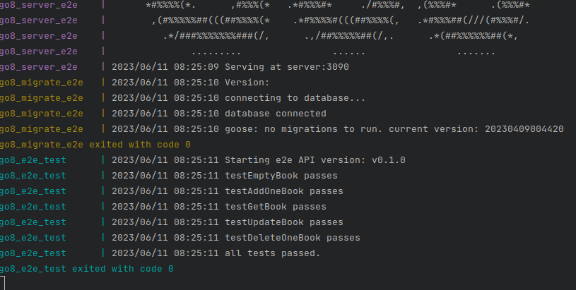

# Introduction
            .,*/(#####(/*,.                               .,*((###(/*.
        .*(%%%%%%%%%%%%%%#/.                           .*#%%%%####%%%%#/.
      ./#%%%%#(/,,...,,***.           .......          *#%%%#*.   ,(%%%#/.
     .(#%%%#/.                    .*(#%%%%%%%##/,.     ,(%%%#*    ,(%%%#*.
    .*#%%%#/.    ..........     .*#%%%%#(/((#%%%%(,     ,/#%%%#(/#%%%#(,
    ./#%%%(*    ,#%%%%%%%%(*   .*#%%%#*     .*#%%%#,      *(%%%%%%%#(,.
    ./#%%%#*    ,(((##%%%%(*   ,/%%%%/.      .(%%%#/   .*#%%%#(*/(#%%%#/,
     ,#%%%#(.        ,#%%%(*   ,/%%%%/.      .(%%%#/  ,/%%%#/.    .*#%%%(,
      *#%%%%(*.      ,#%%%(*   .*#%%%#*     ./#%%%#,  ,(%%%#*      .(%%%#*
       ,(#%%%%%##(((##%%%%(*    .*#%%%%#(((##%%%%(,   .*#%%%##(///(#%%%#/.
         .*/###%%%%%%%###(/,      .,/##%%%%%##(/,.      .*(##%%%%%%##(*,
              .........                ......                .......
A starter kit for Go API development. Inspired by [How I write HTTP services after eight years](https://pace.dev/blog/2018/05/09/how-I-write-http-services-after-eight-years.html).

However, I wanted to use [chi router](https://github.com/go-chi/chi) which is more common in the community, [sqlx](https://github.com/jmoiron/sqlx) for database operations and design towards layered architecture (handler -> business logic -> database).

In short, this kit is a Go + Postgres + Chi Router + sqlx + ent + authentication + testing starter kit for API development.

# Motivation

On the topic of API development, there are two opposing camps between using framework (like [echo](https://github.com/labstack/echo), [gin](https://github.com/gin-gonic/gin), [buffalo](http://gobuffalo.io/)) and starting small and only adding features you need through various libraries. 

However, the second option isn't that straightforward. you will want to structure your project in such a way that there are clear separation of functionalities for your controller, business logic and database operations. Dependencies need to be injected from outside to inside. Being modular, swapping a library like a router or database library to a different one becomes much easier.

# Features

This kit is composed of standard Go library together with some well-known libraries to manage things like router, database query and migration support.

  - [x] Framework-less and net/http compatible handlers
  - [x] Router/Mux with [Chi Router](https://github.com/go-chi/chi)
  - [x] Database Operations with [sqlx](https://github.com/jmoiron/sqlx)
  - [x] Database Operations with [ent](https://entgo.io/docs/getting-started)
  - [x] Database migration with [goose](https://github.com/pressly/goose)
  - [x] Input [validation](https://github.com/go-playground/validator) that returns multiple error strings
  - [x] Read all configurations using a single `.env` file or environment variable
  - [x] Clear directory structure, so you know where to find the middleware, domain, server struct, handle, business logic, store, configuration files, migrations etc. 
  - [x] (optional) Request log that logs each user uniquely based on host address
  - [x] CORS
  - [x] Scans and auto-generate [Swagger](https://github.com/swaggo/swag) docs using a declarative comments format 
  - [x] Custom model JSON output
  - [x] Filters (input DTO), Resource (output DTO) for pagination parsing and custom response respectively.
  - [x] Cache layer
  - [x] Authentication using cookie-based session
  - [x] Uses [Task](https://taskfile.dev) to simplify various tasks like mocking, linting, test coverage, hot reload etc
  - [x] Unit testing of repository, use case, and handler using mocks and [dockertest](https://github.com/ory/dockertest)
  - [x] Integration testing
  - [x] End-to-end test using ephemeral docker containers
  - [x] OpenTelemetry with Grafana, otel-collector, Prometheus, Loki, and Jaeger

# Quick Start

It is advisable to use the latest supported [Go version](https://go.dev/dl/go1.22.6.linux-amd64.tar.gz) (>= v1.22). Optionally `docker` and `docker-compose` for easier start up. There is a quick guide for Debian in the [appendix](#appendix).

Get it

```shell
git clone https://github.com/gmhafiz/go8
cd go8
```

The application depends on a database. Ideally applications load configurations from [environment variable](https://12factor.net/config) (Method A) or from a vault. 

(Method A)

Set values by exporting them into environment variables

```shell
export DB_DRIVER=postgres
export DB_HOST=localhost
export DB_PORT=5432
export DB_USER=postgres
export DB_PASS=password
export DB_NAME=go8_db
```

(Method B)

It is also possible to set them in an `.env` file. Just make sure this file is ignored in `.gitignore` because it should never be checked into source control.

 Fill in your database credentials in `.env` by making a copy of `env.example` first.
```shell
cp env.example .env
vim .env
```

## Database

Have a database ready either by installing them yourself or use the following command. The `docker-compose-infra.yml` will use database credentials set in either `.env` file or environment variables which is initialized in the previous step. In addition, creating database this way will also create an integration database as well.

```sh
docker-compose -f docker-compose-infra.yml up -d postgres
```

Once the database is up, tables and seed data needs to be created using a migration system with the following command. The seed data is needed for authentication later.

```shell
go run cmd/migrate/main.go
go run cmd/seed/main.go
```

You will see a bunch of dependencies download for a first time run followed by the sql migration files

```
2023/09/16 19:06:56 connecting to database... 
2023/09/16 19:06:56 database connected
2023/09/16 19:06:56 OK   20221213140051_create_books.sql (28.26ms)
2023/09/16 19:06:56 OK   20221213140144_create_authors.sql (19.26ms)
2023/09/16 19:06:56 OK   20221213140219_create_book_authors.sql (13.34ms)
2023/09/16 19:06:56 OK   20230409004013_create_users_table.sql (14.13ms)
2023/09/16 19:06:56 OK   20230409004420_create_sessions_table.sql (9.67ms)
2023/09/16 19:06:56 goose: successfully migrated database to version: 20230409004420
```

Run the API with the following command.

```shell
go run cmd/go8/main.go
```

You will see the address of the API is running at.

```shell
2024/08/20 12:52:43 Starting API version: v0.1.0
{"time":"2024-08-20T12:52:43.809953984+10:00","level":"INFO","msg":"connecting to database... "}
{"time":"2024-08-20T12:52:43.820974939+10:00","level":"INFO","msg":"database connected"}
        .,*/(#####(/*,.                               .,*((###(/*.
    .*(%%%%%%%%%%%%%%#/.                           .*#%%%%####%%%%#/.
  ./#%%%%#(/,,...,,***.           .......          *#%%%#*.   ,(%%%#/.
 .(#%%%#/.                    .*(#%%%%%%%##/,.     ,(%%%#*    ,(%%%#*.
.*#%%%#/.    ..........     .*#%%%%#(/((#%%%%(,     ,/#%%%#(/#%%%#(,
./#%%%(*    ,#%%%%%%%%(*   .*#%%%#*     .*#%%%#,      *(%%%%%%%#(,.
./#%%%#*    ,(((##%%%%(*   ,/%%%%/.      .(%%%#/   .*#%%%#(*/(#%%%#/,
 ,#%%%#(.        ,#%%%(*   ,/%%%%/.      .(%%%#/  ,/%%%#/.    .*#%%%(,
  *#%%%%(*.      ,#%%%(*   .*#%%%#*     ./#%%%#,  ,(%%%#*      .(%%%#*
   ,(#%%%%%##(((##%%%%(*    .*#%%%%#(((##%%%%(,   .*#%%%##(///(#%%%#/.
     .*/###%%%%%%%###(/,      .,/##%%%%%##(/,.      .*(##%%%%%%##(*,
          .........                ......                .......
{"time":"2024-08-20T12:52:43.821753831+10:00","level":"INFO","msg":"Serving at 0.0.0.0:3080"}
```

To use, open a new terminal and follow examples in the `examples/` folder

Create a book:

```shell
curl -v --request POST 'http://localhost:3080/api/v1/book' \
 --header 'Content-Type: application/json' \
 --data-raw '{
    "title": "Test title",
    "image_url": "https://example.com",
    "published_date": "2020-07-31T15:04:05.123499999Z",
    "description": 
    "test description"
  }'
```

Retrieve all books:

```shell
curl --request GET 'http://localhost:3080/api/v1/book'
```

To see all available routes, run

```shell
go run cmd/route/main.go
```


To run only unit tests,

```sh
go test -short ./...
```

To run integration tests, if it does not exist yet, a test database needs to be created first.

```sh
docker exec -it go8_postgres psql -U postgres go8_e2e_db
```

Then in the psql command prompt, create a test database
```sql
create database test;
```

To quit the psql prompt, type

```postgresql
\q
```

Once created, run the following command to run tests with `Integration` in the function name to only run integration tests

```sh
go test -run Integration ./...
```

Since the test database has been created, the following command will run both unit and integration tests

```sh
go test ./...
```

For end-to-end tests, run the following docker-compose command. It will run a database, a server, and its table migrations. Then it runs end-to-end program (located in `e2e/main.go`) against it &mdash; all in a self-contained container environment. 

```sh
docker-compose -f e2e/docker-compose.yml up --build
```

You will see a bunch of containers being built and then run. The e2e test ends with the following message

```
go8_e2e_test | 2023/12/30 03:08:04 api is up
go8_e2e_test | 2023/12/30 03:08:04 testEmptyBook passes
go8_e2e_test | 2023/12/30 03:08:04 testAddOneBook passes
go8_e2e_test | 2023/12/30 03:08:04 testGetBook passes
go8_e2e_test | 2023/12/30 03:08:04 testUpdateBook passes
go8_e2e_test | 2023/12/30 03:08:04 testDeleteOneBook passes
go8_e2e_test | 2023/12/30 03:08:04 all tests have passed.
go8_e2e_test exited with code 0
```

Press `Ctrl+C` to quit the e2e test and stop all e2e containers. 

To remove the containers,

```sh
docker-compose -f e2e/docker-compose.yml down
```

# Table of Contents

- [Introduction](#introduction)
- [Motivation](#motivation)
- [Features](#features)
- [Quick Start](#quick-start)
- [OpenTelemetry](#opentelemetry)
- [Tooling](#tooling)
   * [Tools](#tools)
      + [Install](#install)
   * [Tasks](#tasks)
      + [List Routes](#list-routes)
      + [Format Code](#format-code)
      + [Sync Dependencies](#sync-dependencies)
      + [Compile Check](#compile-check)
      + [Unit tests](#unit-tests)
      + [golangci Linter](#golangci-linter)
      + [Check](#check)
      + [Hot reload](#hot-reload)
      + [Generate Swagger Documentation](#generate-swagger-documentation)
      + [Go generate](#go-generate)
      + [Test Coverage](#test-coverage)
      + [Build](#build)
      + [Clean](#clean)
- [Structure](#structure)
   * [Starting Point](#starting-point)
   * [Configurations](#configurations)
      - [Environment Variables](#environment-variables)
      - [.env files](#env-files)
   * [Database](#database)
   * [Router](#router)
   * [Domain](#domain)
      + [Repository](#repository)
      + [Use Case](#use-case)
      + [Handler](#handler)
      + [Initialize Domain](#initialize-domain)
   * [Middleware](#middleware)
      + [Middleware External Dependency](#middleware-external-dependency)
   * [Dependency Injection](#dependency-injection)
   * [Libraries](#libraries)
- [Migration](#migration)
    * [Using Task](#using-task)
        + [Create Migration](#create-migration)
        + [Migrate up](#migrate-up)
        + [Rollback](#rollback)
    * [Without Task](#without-task)
        + [Create Migration](#create-migration-1)
        + [Migrate Up](#migrate-up)
        + [Rollback](#rollback-1)
- [Run](#run)
    * [Local](#local)
    * [Docker](#docker)
        + [docker-compose](#docker-compose)
- [Build](#build-1)
    * [With Task](#with-task)
    * [Without Task](#without-task-1)
- [Authentication](#authentication)
    * [How It Works](#how-it-works)
    * [Expiry](#expiry)
    * [Logging Out](#logging-out)
    * [Security](#security)
    * [Performance](#performance)
    * [Integration testing](#integration-testing)
- [Cache](#cache)
    * [LRU](#lru)
    * [Redis](#redis)
- [Swagger docs](#swagger-docs)
- [Utility](#utility)
- [Testing](#testing)
   * [Unit Testing](#unit-testing)
      - [Handler](#handler-1)
      - [Use Case](#use-case-1)
      - [Repository](#repository-1)
   * [Integration Testing](#integration-testing-1)
   * [End-to-End Test](#end-to-end-test)
- [TODO](#todo)
- [Acknowledgements](#acknowledgements)
- [Appendix](#appendix)
   * [Dev Environment Installation](#dev-environment-installation)

# OpenTelemetry

During development, we follow a process and have many tools including functional tests (unit, integration, end-to-end), static analyzer, performance regression tests, and others before we ship to production. In spite of developers' best effort, bugs do occur in production. Typical tools we have during development may not be applicable to a production setting. What we need is some visibility on how our program's internal state and how it behaves in production for example, error logs can be useful to give us this information. An endpoint which is slow will need to be looked at, and it will be great if we can pinpoint exactly where the offending part of a codebase is. 

OpenTelemetry is a collection of APIs, SDKs, and tools to instrument, generate, collect, and export telemetry data including metrics, logs, and traces. Using docker-compose, all infrastructure needed to bring up OpenTelemetry integration can be started automatically. This includes configurations and the dashboard.

```sh
docker-compose -f docker-compose-infra.yml up -d
```

Once everything is up, the dashboard is accessed through Grafana at http://localhost:3300. Initial login credential is admin/admin. Then you will be prompted to set a new password.

Before moving forward with the dashboard, OpenTelemetry needs to be enabled in the api server. Switch on the feature in environment variable either by exporting it or by editing the value for `OTEL_ENABLE` from `false` to `true` in `.env`.

```sh
sed -i "s/^OTEL_ENABLE=.*/OTEL_ENABLE=true/" ".env"
# or
export OTEL_ENABLE=true
```

As everything is started as containers, finding the services are now done with its container name instead of `localhost`. Using docker-compose provides the convenience of setting the correct host necessary for api server to find the services. Stop the current api server and start it again with the provided docker-compose file.

```sh
ctrl+C
docker-compose up -d
```

Circling back to Grafana, the dashboard named 'Observe' is empty until there are some data being created. Synthetic load can be generated by using tools like [k6](https://grafana.com/docs/k6/latest/get-started/installation/) or [locust](https://docs.locust.io/en/stable/installation.html).

```sh
k6 run scripts/k6.js
```

# Tooling

The above quick start is sufficient to start the API. However, we can take advantage of a tool to make task management easier. While you may run migration with `go run cmd/migrate/main.go`,  it is a lot easier to remember to type `task migrate` instead. Think of it as a simplified `Makefile`.

You may also choose to run sql scripts directly from `database/migrations` folder instead.

This project uses [Task](https://github.com/go-task/task) to handle various tasks such as migration, generation of swagger docs, build and run the app. It is essentially a [sh interpreter](https://github.com/mvdan/sh).

Install task runner binary bash script:

```sh
sudo ./scripts/install-task.sh
```

This installs `task` to `/usr/local/bin/task` so `sudo` is needed.

`Task` tasks are defined inside `Taskfile.yml` file. A list of tasks available can be viewed with:

```sh
task -l
```
or

```sh
task list
```

## Tools

Various tooling can be installed automatically by running which includes

 * [golang-ci](https://golangci-lint.run)
    * An opinionated code linter from https://golangci-lint.run/
 * [swag](https://github.com/swaggo/swag)
    * Generates swagger documentation
 * [goose](https://github.com/pressly/goose)
    * Migration tool
 * [ent](https://entgo.io/docs/getting-started)
    * Database ORM tool
 * [mirip](https://github.com/gmhafiz/mirip)
    * Generate mocks from interface 
 * [air](https://github.com/air-verse/air)
    * Hot reload app 

### Install

Install the tools above with:

```sh
task install:tools
```

## Tasks

Various tooling are included within the `Task` runner. Configurations are done inside `Taskfile.yml` file.

### List Routes

List all registered routes, typically done by `register.go` files by

```sh
go run cmd/route/route.go
```

or

```sh
task routes
```

### Go generate

```sh
task generate
```

Runs `go generate ./...`. It looks for `//go:generate` tags found in .go files. Useful for recreating mock file for unit tests.

### Generate Swagger Documentation

Ensure your environment variable is `API_RUN_SWAGGER=true`, then re-run the api. Generates swagger files with the following command. 
```sh
task swagger
```

This reads annotations from controller and model file to create a swagger documentation file. The UI can be accessed from [http://localhost:3080/swagger/](http://localhost:3080/swagger/)

### Format Code

```sh
task fmt
```

Runs `go fmt ./...` to lint Go code

`go fmt` is part of official Go toolchain that formats your code into an opinionated format.

### Compile Check

Runs Go's tooling `go vet ./...`.

```sh
task vet
```

Quickly catches compile error.

### golangci Linter

```sh
task lint
```

Runs [https://golangci-lint.run](https://golangci-lint.run/) linter. Includes [gosec](https://github.com/securego/gosec) via `golangci.yaml`.

### Unit tests

Runs unit tests using `go test ./...`. Other commands are `task test:verbose` for verbose output and `task test:slow` to find top slow-running tests.

```sh
task test
```

### Vulnerability Check

Find software supply chain vulnerabilities using https://vuln.go.dev.

```sh
task vuln
```

This runs `govulncheck ./...`

### Check

```sh
task check
```

Runs all the above tasks (Format Code until Security Checks)

### Sync Dependencies

```sh
task tidy
```

Runs `go mod tidy` to sync dependencies.

### Hot reload

```sh
task dev
```

Runs `air` which watches for file changes and rebuilds binary. Configure in `.air.toml` file.

### Test Coverage

```sh
task test:coverage
```

Runs unit test coverage with `go test -cover ./...`

### Build

```sh
task build
```

Create a statically linked executable for linux.

### Clean

```sh
task clean
```

Clears all files inside `bin` directory as well as cached unit test files.


# Structure

This project follows a layered architecture mainly consisting of three layers:

1. Handler
2. Use Case
3. Repository


The handler is responsible to receiving requests, validating them hand over to business logic.
Values returned from use case layer is then formatted and to be returned to the client.

Business logic (use case) is the meat of operations, and it calls a repository if necessary.

Database calls lives in this repository layer where data is retrieved from a store.

All of these layers are encapsulated in a domain, and an API can contain many domain.

Each layer communicates through an interface which means the layer depends on
abstraction instead of concrete implementation. This achieves loose-coupling and
makes unit testing easier.

## Starting Point

Starting point of project is at `cmd/go8/main.go`


The `Server` struct in `internal/server/server.go` is where all important dependencies are
registered and to give a quick glance on what your server needs.


`s.Init()` in `internal/server/server.go` simply initializes server configuration, database, input validator, router, global middleware, domains, and swagger. Any new dependency added to the `Server` struct can be initialized here too.


## Configurations

The api can be configured by taking values from environment variables or an `.env` file.

These variables are read into specific `Configs` struct initialized in `configs/configs.go`. Each of the embedded struct are defined in its own file of the same package where its fields are read from either environment variable or `.env` file.


This approach allows code completion when accessing your configurations.


#### Environment Variables

Simply set the environment variables by exporting them like so:

```sh
export DB_DRIVER=postgres
export DB_HOST=localhost
export DB_PORT=5432
etc
```

#### .env files

Alternatively, the `.env` file can be used. Just make sure this file is not committed in source control. Make a copy from example env file:

```sh
cp env.example .env
```

#### Add new Config Struct

To add a new type of configuration, for example for Elasticsearch

1. Create a new go file in `./configs`

```shell
touch configs/elasticsearch.go
```

2. Create a new struct for your type

```go
type Elasticsearch struct {
  Address  string
  User     string
  Password string
}
```

Various validation and default values among others can also be configured into this struct. Visit https://github.com/kelseyhightower/envconfig for more details.

3. Add a constructor for it

```go
func ElasticSearch() Elasticsearch {
   var elasticsearch Elasticsearch
   envconfig.MustProcess("ELASTICSEARCH", &elasticsearch)

   return elasticsearch
}
``` 

4. Register to main Config struct
 
```go
type Config struct {
	Api
	Cors
	...
	Elasticsearch // add the constructor
}

func New() *Config {
	...
	return &Config{
		...
		Elasticsearch: ElasticSearch(), // Add here
    }
}
```

5. Add to `.env` of the new environment variables

A namespace is defined as `ELASTICSEARCH`.

```shell
ELASTICSEARCH_ADDRESS=http://localhost:9200
ELASTICSEARCH_USER=user
ELASTICSEARCH_PASS=password
```

#### Others

Limiting the number of connection pool avoids ['time-slicing' of the CPU](https://github.com/brettwooldridge/HikariCP/wiki/About-Pool-Sizing). Use the following formula to determine a suitable number

    number of connections = ((core_count * 2) + effective_spindle_count)    

## Database

Migrations files are stored in `database/migrations` folder. [goose](https://github.com/pressly/goose) library is used to perform migration using `task` commands.

## Router

Router multiplexer or mux is created for use by `Domain`. While [chi](https://github.com/go-chi/chi) library is being used here, you can swap out the router to an alternative one when assigning `s.router` field. However, you will need to adjust how you register your handlers in each domain.

## Domain

Let us look at how this project attempts at layered architecture. A domain consists of:

1. Handler (Controllers)
2. Use case (Business Logic)
3. Repository (Database)

Let us start by looking at how `repository` is implemented.

### Repository

Starting with `Database`. This is where all database operations are handled. Inside the `internal/domain/health` folder:


Interfaces for both use case and repository are on its own file under the `health` package while its implementation are in `usecase` and `repository` package respectively.

The `health` repository has a single method

`internal/domain/health/repository.go`

```go
 type Repository interface {
     Readiness() error
 }
````    

And it is implemented in a package called `postgres` in `internal/domain/health/repository/postgres/postgres.go`

```go
func (r *repository) Readiness() error {
  return r.db.Ping()
}
```

### Use Case

This is where all business logic lives. By having repository layer underneath in a separate layer, those functions are reusable in other use case layers.

### Handler

This layer is responsible in handling request from outside world and into the `use case` layer. It does the following:

1. Parse request into a 'request' struct
2. Sanitize and validates said struct
3. Pass into `use case` layer
4. Process results from coming from `use case` layer and decide how the payload is going to be formatted to the outside world.

Route API are defined in `RegisterHTTPEndPoints` in their respective `register.go` file.

####  1. Parse request into 'request' struct

A struct must be defined with fields along with its type. For example in `book.CreateRequest`, there are four possible inputs and all of them are required, denoted by struct tag. `ImageURL` needs to be a URL, which is a handy utility provided by the [validation library](https://github.com/go-playground/validator), among others.

```go
type CreateRequest struct {
	Title         string `json:"title" validate:"required"`
	PublishedDate string `json:"published_date" validate:"required"`
	ImageURL      string `json:"image_url" validate:"url"`
	Description   string `json:"description" validate:"required"`
}
```
`validate` struct tag is parsed by the library to know which one is required. `json` struct tag helps with customising fields' letter case.

To parse the request, simply use the `json` package.

```go
var bookRequest book.CreateRequest
err := json.NewDecoder(r.Body).Decode(&bookRequest)
```

Take care to supply the address of `bookRequest` variable by prepending ampersand `&` to it.

If there are no errors, the `bookRequest` can be passed into the usecase or repository layer.

Using the `json` package to parse is although simple, works well. It doesn't cover all cases in which you may want to refer to this [article](https://www.alexedwards.net/blog/how-to-properly-parse-a-json-request-body)

### Initialize Domain

Finally, a domain is initialized by wiring up all dependencies in server/initDomains.go. Here, any dependencies can be injected such as a custom logger.

```go
func (s *Server) initBook() {
   newBookRepo := bookRepo.New(s.GetDB())
   newBookUseCase := bookUseCase.New(newBookRepo)
    s.Domain.Book = bookHandler.RegisterHTTPEndPoints(s.router, newBookUseCase)
}
```

## Middleware

A middleware is just a handler that returns a handler as can be seen in the `internal/middleware/cors.go`

```go
func Cors(next http.Handler) http.Handler {
    return http.HandlerFunc(func(w http.ResponseWriter, r *http.Request) {
    
        // do something before going into Handler
        
        next.ServerHTTP(w, r)
        
        // do something after handler has been served
    }
}
```

Then you may choose to have this middleware to affect all routes by registering it in`setGlobalMiddleware()` or only a specific domain at `RegisterHTTPEndPoints()` function in its `register.go` file.


### Middleware External Dependency

Sometimes you need to add an external dependency to the middleware which is often the case for
authorization be that a config or a database. To do that, we wrap our middleware with a
`func(http.Handler) http.Handler`. Any dependencies can now be passed in into `Auth()`.

```go
func Auth(cfg configs.Configs) func(http.Handler) http.Handler {
    return func(next http.Handler) http.Handler {
        return http.HandlerFunc(func(w http.ResponseWriter, r *http.Request) {
            claims, err := getClaims(r, cfg.Jwt.SecretKey)
            if err != nil {
                w.WriteHeader(http.StatusUnauthorized)
                return
            }
    
            next.ServeHTTP(w, r)
        })
    }
}
```

## Dependency Injection

Dependency injection in Go is simple. We can simply pass in whatever we need
into the function or method signature. There is no need to make a dependency injection
container like other object-oriented programming language.

How does dependency injection happens? It starts with `InitDomains()` method. We
initialize the dependency we want early in the start-up of the program and then
pass it down the layers.

```go
newBookRepo := bookRepo.New(s.DB())
newBookUseCase := bookUseCase.New(newBookRepo)
s.Domain.Book = bookHandler.RegisterHTTPEndPoints(
	s.router,
	s.validator,
	newBookUseCase,
)
```

The repository gets access to a pointer to `sql.DB` from the `s.DB()`
initialisation to perform database operations. This layer also knows nothing of
layers above it. `NewBookUseCase` depends on that repository and finally the
handler depends on the use case.

## Libraries

Initialization of external libraries are located in `third_party/`

Since `sqlx` is a third party library, it is initialized in `/third_party/database/sqlx.go`

# Migration

Migration is a good step towards having a versioned database and makes publishing to a production server a safe process.

All migration files are stored in `database/migrations` folder.

## Using Task

### Create Migration

Using `Task`, creating a migration file is done by the following command. Name the file after `NAME=`.

```sh
task migrate:create NAME=create_a_tablename
```

Write your schema in pure sql in the 'up' section and any reversal in the 'down' section of the file.
 
### Migrate up

After you are satisfied with your `.sql` files, run the following command to migrate your database.

```sh
task migrate
```

To migrate one step

```sh
task migrate:step
```
      
### Rollback
    
To roll back migration by one step

```sh
task migrate:rollback
```

Further `goose` commands are available in its [page](https://github.com/pressly/goose)


## Without Task

### Create Migration

Once `goose` tool is [installed](https://github.com/pressly/goose), create a migration with

```sh
migrate create -ext sql -dir database/migrations -format unix "{{.NAME}}"
```

### Migrate Up

You will need to create a data source name string beforehand. e.g.:

    postgres://postgres_user:$password@$localhost:5432/db?sslmode=false

Note: You can save the above string into an environment variable for reuse e.g.

```sh
export DSN=postgres://postgres_user:$password@$localhost:5432/db?sslmode=false
```

Then migrate with the following command, specifying the path to migration files, data source name and action.

```sh
migrate -path database/migrations -database $DSN up
```

To migrate 1 step,

```sh
migrate -path database/migrations -database $DSN up-by-one
```

### Rollback

Rollback migration by using `down` action and the number of steps

```sh
migrate -path database/migrations -database $DSN down
```

# Run

## Local

Conventionally, all apps are placed inside the `cmd` folder.

If you have `Task` installed, the server can be run with:


```sh
task run
```

or without `Task`, just like in quick start section:

```sh
go run cmd/go8/main.go
```

## Docker

You can build a docker image with the app with its config files. Docker needs to be installed beforehand.

```sh
task docker:build
```

This task also makes a copy of `.env`. Since Docker doesn't copy hidden file, we make a copy of it on our `src` stage before transferring it to our final `scratch` stage. It also inserts formats git tag and git hash as the API version which runs at compile time.

Note that this is a multistage Dockerfile. Since we statically compile this API, we can use a minimal images like a `distroless` that includes both timezones and CA certificates.

Run the following command to build a container from this image. `--net=host` tells the container to use local's network so that it can access host database.

```sh
docker-compose up -d postgres # If you haven't run this from quick start
```

Or using Task
```sh
task docker:run
```

### docker-compose

If you prefer to use docker-compose instead, both server and the database can be run with:

```sh
task docker-compose:start
```

# Build

## With Task

If you have task installed, simply run

```sh
task build
```

It does a task check prior to the build and puts both the binary and `.env` files into `./bin` folder

## Without Task

```sh
go mod download
CGO_ENABLED=0 GOOS=linux
go build -ldflags="-X main.Version=$(git describe --abbrev=0 --tags)-$(git rev-list -1 HEAD) -s" -o ./server ./cmd/go8/main.go;
```

# Authentication

Authentication is proving who or identity of a person as opposed to Authorization where it tells what this person can do. The most popular way is by using JWT which is a stateless solution by using signed token generated from the server and then stored client-side. This token contains an algorithm, date and time it expires, and may store arbitrary data. This token is attached to each subsequent requests by client-side where the server verifies its validity by checking if the token has not been tampered and then see if it is not past expiry date.

This repository on the other hand demonstrates an age-old method of authentication &mdash; sessions. It generates a session containing random characters and set in a cookie. This session is also stored in a database, and this makes it a stateful solution. Arbitrary data can be saved inside the session by saving it in the database but client-side only receives the random token.

Advantage of this approach is invalidating or logging out a user can be done by simply deleting the associated session record in the database. With `HttpOnly` flag set to true, this ensures the cookie can only be read by the browser, not client-side javascript. Thus, this prevents cross-site scripting (XSS) attack. `SameSite=lax` and setting the `Domain` minimises the risk of cross-site request forgery (CSRF). However, this approach incurs additional cost of database querying in every request.

Why not JWT in cookie? This prevents XSS with correct cookie flags. However, session invalidation is not possible without storing the sessions in a persistent store.

## How It Works

Session management is done using [alexedwards/scs](https://github.com/alexedwards/scs) library. All routes go through a custom middleware based on `LoadAndSave` middleware. On top of storing data in a database and setting the cookie in a response header before going into any handler, it also saves user ID as a foreign key to `users` table.

At first time login, no cookie is present. Upon successful login, we call `RenewToken()` method that creates a new random string token, and after it exits the handler, it re-enters the `LoadAndSave` middleware to save the token into the database. If any action to add data were done, it will be saved in the database, not in the cookie. The response will contain the cookie in the header.

## Usage

It is recommended to both migrate (if you have not) and seed `users` table with a super admin account. Run with

```sh
go run cmd/migrate/main.go
go run cmd/seed/main.go
```

This generates a super admin user with a randomly generated password. This password is automatically saved in `.env` file.

Let us register a new user:

```sh
curl -vX POST  -H 'content-type: application/json' 'http://localhost:3080/api/v1/register' -d '{
  "first_name": "Hafiz",
  "last_name": "Shafruddin",
  "email": "email@example.com",
  "password": "highEntropyPassword"
}'
```

You should get a 201 Created HTTP status response. Now you can login

```sh
curl -vX POST -H 'content-type: application/json' \ 
'http://localhost:3080/api/v1/login' \
-d '{
  "email": "email@example.com",
  "password": "highEntropyPassword"
}
'
```

You will get a 200 OK HTTP status response along with a cookie in the header. By default, our token is stored from `session` key in the `Set-Cookie` header. In this example, it is `gedFYqAUXejpgmBhnCkKLip7dOjecbBC1HzSHCX7KGI`.

```
< HTTP/1.1 200 OK
< Cache-Control: no-cache="Set-Cookie"
< Content-Type: application/json
< Set-Cookie: session=gedFYqAUXejpgmBhnCkKLip7dOjecbBC1HzSHCX7KGI; Path=/; Expires=Wed, 03 May 2023 13:45:59 GMT; Max-Age=86365; SameSite=Lax
< Vary: Origin
< Vary: Cookie
< Date: Tue, 02 May 2023 13:46:34 GMT
< Content-Length: 147
```

At this point, you will also see that a new record is stored into `sessions` table.

```sql
SELECT * FROM sessions;
```

You can see the token is stored along with our user ID. `data` column stores arbitrary payload in the session as supported by [alexedwards/scs](https://github.com/alexedwards/scs) library.

| token                                       | user\_id | data                        | expiry                            |
|:--------------------------------------------|:---------|:----------------------------|:----------------------------------|
| gedFYqAUXejpgmBhnCkKLip7dOjecbBC1HzSHCX7KGI | 2        | 0x26FF810301...truncated... | 2023-05-11 13:17:38.062590 +00:00 |


For making subsequent requests on protected routes, we need to attach the cookie in the header. If you are using browser's native `fetch` function, simply use `credentials: include` or if using axios, switch on the `withCredentials` setting:

fetch
```js
login() {
  $fetch(`${this.baseURL}/login`, {
    headers: { 'Access-Control-Allow-Origin': true },
    credentials: 'include',
    method: 'POST',
    body: {
      email: 'email@example.com',
      password: 'password',
    },
  })
```

axios
```
axios.defaults.withCredentials = true
```

For now, let us make a curl request.

```sh
curl -v 'http://localhost:3080/api/v1/restricted/me' --cookie "session=gedFYqAUXejpgmBhnCkKLip7dOjecbBC1HzSHCX7KGI"
```

And you will get a 200 HTTP response along with user ID payload `{"user_id":2}`.

## Expiry

By default, the session stays for 24 hours but this can be changed by editing `SESSION_DURATION` key. A background job regularly checks the table for expired sessions and remove them from the table.

## Logging Out

A logged in user can simply call `/v1/logout` to log out. The cookie need to be present for the api to know which token to delete.

A super admin can log out any user provided that the super admin's `users` ID is equal to `1`. Obviously a proper authorization is needed in real-world application.

## Security Consideration

These are the important cookie flags that needs to be reviewed.

1. Secure: Ensures cookie are only used in secure TLS (https)
2. HttpOnly: Ensure no client-side javascript can read the values in cookie, only browser can. This prevents XSS
3. Domain: Where cookie is expected to work
4. SameSite: Using  either `Lax` or `Strict` ensures cookies only work on your domain

Thanks to `HttpOnly` flag, no client-side can access this token thus preventing XSS attack. Both setting a domain
and `SameSite` flag value set to at least `Lax` helps with preventing CSRF attack &mdash; although it does not prevent CSRF entirely. For example `SameSite` attribute was not supported in [old browsers](https://caniuse.com/?search=samesite). For this, we can request a new token called CSRF Token. For every modifying requests, we attach this new token alongside and check its existence in the database.

Also set allowed domains if possible in either `.env` or environment variable.

```sh
export SESSION_DOMAIN=https://mySite.com
```

## Performance

Since database is called for every protected endpoints, both throughput and latency can be an issue. However, token column is indexed which makes record retrieval near instant &mdash; typically sub-millisecond.

The authentication [library](https://github.com/alexedwards/scs) also includes a redis implementation but a custom implementation is needed to also store user ID against a session token when committing a token to Redis.


## Integration Testing

The `authentication` domain is tested using integration tests (in `integration_test.go`) which covers the handler and the database. We use a table-driven driven tests where a set of scenarios are stored as a slice (array) containing what we supply in the parameters, what result we expect from those parameters, and we gave a name to identify each test. The slice is then looped and calls appropriate functions. The tests are tested against real database by spinning them up as docker containers. With testing, implementations can be changed and improved without affecting correctness and desired outcome.

Note: This repository also details regarding unit tests which are explained in the [Testing](#testing) section.

To run only integration test,

```sh
go test -run Integration ./...
```

# Cache

The three most significant bottlenecks are

1. Input output (I/O) like disk access including database.
2. Network calls - like calling another API.
3. Serialization - like serializing or deserializing JSON

We demonstrate how caching results can speed up API response:

## LRU

To make this work, we introduce another layer that sits between use case and database layer.

`internal/author/repository/cache/lru.go` shows an example of using an LRU cache to tackle the biggest bottleneck. Once we get a result for the first time, we store it by using the requesting URL as its key. Subsequent requests of the same URL will return the result from the cache instead of from the database.

The request url only exists in the handler layer by accessing it from `*http.Request`.
To pass the request url to our cache layer, we can either pass it down the layers as
a method parameter, or we can use `context` to save this url. In general, `context`
is not the way to store variables but since this url is scoped to this one request,
it is okay.

```go
ctx := context.WithValue(r.Context(), author.CacheURL, r.URL.String())
```

Then in the cache layer, we retrieve it using the same key (`author.CacheURL`)
and we must assert the type to `string`.

```go
url := ctx.Value(author.CacheURL).(string)
```

The code above can panic if the key does not exist. To be safer, we can check if
a value is retrieved successfully.

```go
url, ok := ctx.Value(author.CacheURL).(string)
if !ok {
	// handle if not ok, or call repository layer.
}
```

Using the `url`, we try and retrieve a value from the cache,
```go
val, ok := c.lru.Get(url)
```

If it doesn't exist, retrieve from database layer and add it to our cache for future use.
```go
c.lru.Add(url, res)
```

Avoiding I/O bottleneck results in an amazing speed, **11x** more requests/second (328 bytes response size) compared to an already blazing fast endpoint as shown by `wrk` benchmark:

CPU: AMD 3600 3.6Ghz
Storage: SSD

```shell
wrk -t2 -d60 -c200  'http://localhost:3080/api/v1/author?page=1&size=3'
Running 1m test @ http://localhost:3080/api/v1/author?page=1&size=3
  2 threads and 200 connections
  Thread Stats   Avg      Stdev     Max   +/- Stdev
    Latency     4.23ms    5.07ms  71.75ms   83.36%
    Req/Sec    40.64k     3.55k   52.91k    68.45%
  4847965 requests in 1.00m, 1.48GB read
Requests/sec:  80775.66
Transfer/sec:     25.27MB
```

Compared to calling database layer:
```shell
wrk -t2 -d60 -c200  'http://localhost:3080/api/v1/author?page=1&size=3'
Running 1m test @ http://localhost:3080/api/v1/author?page=1&size=3
  2 threads and 200 connections
  Thread Stats   Avg      Stdev     Max   +/- Stdev
    Latency    70.66ms  116.57ms   1.24s    88.09%
    Req/Sec     3.66k   276.15     4.53k    70.50%
  437285 requests in 1.00m, 136.79MB read
Requests/sec:   7280.82
Transfer/sec:      2.28MB
```

Since a cache stays in the store if it is frequently accessed, invalidating the cache must be done if there are any changes to the stored value in the event of update and deletion. Thus, we need to delete the cache that starts with the base URL of this domain endpoint.

For example:
```go
func (c *AuthorLRU) Update(ctx context.Context, toAuthor *models.Author) (*models.Author, error) {
	c.invalidate(ctx)

	return c.service.Update(ctx, toAuthor)
}

func (c *AuthorLRU) invalidate(ctx context.Context) {
	url := ctx.Value(author.CacheURL)
	split := strings.Split(url.(string), "/")
	baseURL := strings.Join(split[:4], "/")

	keys := c.lru.Keys()
	for _, key := range keys {
		if strings.HasPrefix(key.(string), baseURL) {
			c.lru.Remove(key)
		}
	}
}
```
## Redis

By using Redis as a cache, you can potentially take advantage of a cluster architecture for more RAM instead of relying on the RAM on current server your API is hosted. Also, the cache won't be cleared like in-memory `LRU` when a new API is deployed.

Similar to LRU implementation above, this Redis layer sits in between use case and database layer.

This Redis library requires payload in a binary format. You may choose the builtin `encoding/json` package or `msgpack` for smaller payload and **7x** higher speed than without a cache. Using `msgpack` over `json` tackles serialization bottleneck.

```go
// marshal 
cacheEntry, err := msgpack.Marshal(res)
// unmarshal
err = msgpack.Unmarshal([]byte(val), &res)
```

```shell
wrk -t2 -d60 -c200  'http://localhost:3080/api/v1/author?page=1&size=3'
Running 1m test @ http://localhost:3080/api/v1/author?page=1&size=3
  2 threads and 200 connections
  Thread Stats   Avg      Stdev     Max   +/- Stdev
    Latency     4.05ms    2.56ms  37.48ms   73.63%
    Req/Sec    25.48k     1.45k   30.73k    71.29%
  3039522 requests in 1.00m, 0.93GB read
Requests/sec:  50638.73
Transfer/sec:     15.84MB
```


# Swagger docs

Swagger UI allows you to play with the API from a browser


     
Edit `cmd/go8/go8.go` `main()` function host and BasePath  

    // @host localhost:3080
    // @BasePath /api/v1

   
Generate with

    task swagger # runs: swag init 
    
Access at

    http://localhost:3080

The command `swag init` scans the whole directory and looks for [swagger's declarative comments](https://github.com/swaggo/swag#declarative-comments-format) format.

Custom theme is obtained from [https://github.com/ostranme/swagger-ui-themes](https://github.com/ostranme/swagger-ui-themes)

# Utility

Common tasks like retrieving query parameters or `filters` are done inside `utility` folder. It serves as one place abstract functionalities used across packages.

Note that further packages are in the subdirectories of `utilty`. No files
ar under `utilty` package because it is [unclear from the name](https://go.dev/doc/effective_go#package-names) on what it does. 

# Testing

A testable code is a sign that you have a good code structure. However, it can be hard to write not only of a function, but also how different functions work together. 
Going on a tangent, following [SOLID principle](https://en.wikipedia.org/wiki/SOLID)  is a good way to design our code and make it testable. But this repository isn't nearly complex enough to show good examples of each principle. In any case, we shall start with unit tests.

## Unit Testing

Unit testing can be run with

```sh
task test:unit
```
    
Which runs `go test -v -short ./...`

A quick note, in Go, a unit test file is handled by appending `_test` to a file's name. For example, to test `/internal/domain/book/handler/http/handler.go`, we add unit test file in the same directory by creating `/internal/domain/book/handler/http/handler_test.go`. No more hunting for test file nested deep in a `tests` directory like in other language!

Tests that run fast means you run them [more often](https://medium.com/pragmatic-programmers/unit-tests-are-first-fast-isolated-repeatable-self-verifying-and-timely), which leads to writing more tests. You can find top ten slow tests by running the following [command](https://leighmcculloch.com/posts/go-find-slow-tests/)

_Only for Unix-based operating system_

Shell command:
```sh
# Cleans test cache
go clean -testcache

# Test output is json format for easy parsing by jq tool.
go test -v -json ./... | jq -r 'select(.Action == "pass" and .Test != null) | .Test + "," + (.Elapsed | tostring)'  | sort -r -k2 -n -t, | head
```

Or using `Task`:
```sh
task test:slow
```

To perform a unit test we take advantage of go's interface. The layers between
handler, use case and database are loosely-coupled. This is achieved by accepting
an interface and return a struct. This way, you can swap that struct implementation
with something else, say, a mock. So when you run the unit test, it will run
that mock implementation instead of your concrete implementation. This is all
thanks to Go's interface which is implicit.

This repository shows table-driven unit testing strategy  in all three layers.
Both handler and usecase layers swaps the implementation of underneath layer 
with mocks while in repository layer, we use _real_ database in docker to test
against, using `dockertest` library.

### Handler

We explore on how to perform unit testing on creating an Author. There are several things that need to happen, namely:

1. Create a request.
2. Validate request.
3. Call business logic layer underneath it and handle various error that may come up.
    - We are not going to actually call our business logic layer. We use mocks instead.
4. Perform data transformation for user consumption.
5. Compare errors and values.

In general, all unit tests will have `args` and `want` struct. `args` struct is
what we need to supply to the unit test while `want` struct is where we define
what we expect the result is going to be.

Firstly, we create `handler_test.go` file in the same directory. Create a unit
test function called `TestHandler_Create()`.

```go
func TestHandler_Create(t *testing.T) {
	
}
```

In there, we add `CreateRequest` to `args` struct.

```go
type args struct {
    *author.CreateRequest
}
```

In `want` struct, we expect the usecase to return three things, the author an 
error, and http status code. We add an HTTP status response code because our 
handler can return different code depending on the result.

What is strange here is we included a `usecase` struct. This is the struct that
contains values that our mock will return.

```go
type want struct {
	usecase struct {
        *author.Schema
        error
    }
    response *author.GetResponse
    status int
    error
}
```

The final struct embeds both structs, and we give a name to it. Naming the test
makes it easier to run individual tests.

```go
type test struct {
    name string
    args
    want
}
```

Now that we have all necessary structs, we can begin with our table-driven tests.
It is just a matter of filling `test` struct with our values.

```go
tests := []test{
	{
        name: "simple",
        args: args {
            CreateRequest: &author.CreateRequest{
                FirstName:  "First",			
                MiddleName: "Middle",			
                LastName:   "Last",
	            Books:      nil,
            }   		
        },
        want: want{
				usecase: struct {
					*author.Schema
					error
				}{
					&author.Schema{
						ID:         1,
						FirstName:  "First",
						MiddleName: "Middle",
						LastName:   "Last",
						CreatedAt:  time.Now(),
						UpdatedAt:  time.Now(),
						DeletedAt:  nil,
						Books:      make([]*book.Schema, 0),
					},
					nil,
				},
				response: &author.GetResponse{
					ID:         1,
					FirstName:  "First",
					MiddleName: "Middle",
					LastName:   "Last",
					Books:      make([]*book.Schema, 0),
				},
				err:    nil,
				status: http.StatusCreated,
			},
}
```

As you can see, the _author_ record gets replicated three times. But there is a
subtle difference between the input and output. In the `args` struct, we only
supply three things, the names, but left the books as empty. In the `response`
struct, it has the names, but also a zero-length array of books! This is an
intended behaviour - I purposely wanted to return an array no matter what.

So within this `tests` slice, we can add as many unit tests as we want. We could
try giving invalid input, input that fails validation, etc.  

To run the tests, we loop over this slice of tests:

```go
for _, test := range tests {
    t.Run(test.name, func(t *testing.T) {
        
    }
}
```

We use `httptest` package to call our tests by creating a `writer`(request) to 
call the handler, and a `recorder` to receive response from the handler.

```go
rr := httptest.NewRequest(http.MethodPost, "/api/v1/author", <body>)
ww := httptest.NewRecorder()
```

The request points to the URL of the endpoint, and we make a `POST` request to it.
Since we are sending a JSON payload, we send it in the third argument. It accepts
an `io.Reader` so we need to encode our JSON payload into `bytes.Buffer`:

```go
var buf bytes.Buffer
err = json.NewEncoder(&buf).Encode(test.args.CreateRequest)

rr := httptest.NewRequest(http.MethodPost, "/api/v1/author", &buf)
```

This is a good place to assert that no error has happened.

```go
err = json.NewEncoder(&buf).Encode(test.args.CreateRequest)
assert.Nil(t, err)
```

To call our handler, we need to instantiate it. It is created from `RegisterHTTPEndPoints()`.

```go
h := RegisterHTTPEndPoints(router, val, uc)
```

This function requires three dependencies. The `router` and `validator` are easy:

```go
router := chi.NewRouter()
val := validator.New()
```

The final dependency requires a bit of work. The handler depends on the usecase
interface, and it in turn calls the appropriate concrete implementation. For our
unit test, we swap out the implementation with a mock. And this mock returns
value from our `want.usecase` struct. Now our unit test can work in isolation, 
and do not depend on any layer underneath it!

Create a new file called `usecase_mock.go`. Declare a new mock struct and within it,
contains a field that matches our usecase signature by looking at the usecase 
interface.

`usecase.go`
```go
type UseCase interface {
    Create(ctx context.Context, a *author.CreateRequest) (*author.Schema, error)
}
```

`usecase_mock.go`
```go
type AuthorUseCaseMock struct {
    CreateFunc func(ctx context.Context, a *author.CreateRequest) (*author.Schema, error)
}
```
Notice that we append the `Create()` method with `Func` field. Now that we have
the struct defined, we add a concrete implementation from it.

`usecase_mock.go`
```go
func (m *AuthorMock) Create(ctx context.Context, a *author.CreateRequest) (*author.Schema, error) {
	return a.CreateFunc(ctx, req)
}
```

Now that we have a usecase mock, we can now give the `uc` variable for `RegisterHTTPEndPoints()` function. Using `AuthorUseCaseMock` struct from `mock` package, we initialize `CreateFunc` field from it. Then, it is just a matter of returning the values to what we have defined in our `want` struct.

`handler_test.go`
```go
uc := &mock.AuthorUseCaseMock{
    CreateFunc: func(ctx context.Context, a *author.CreateRequest) (*author.Schema, error) {
        return test.want.usecase.Schema, test.want.usecase.error
    },
}
```

We finally have all of our dependencies initialized. Now we can call `Create()`
method. We pass in the writer(`ww`) and a recorder `rr` into it - which matches our
handler signature (`Create(w http.ResponseWriter, r *http.Request)`)

```go
h := RegisterHTTPEndPoints(router, val, uc)
h.Create(ww, rr)
```

Response is recorded into `ww` variable. To receive the response, we decode from
`ww.Body` into `author.Schema` struct:

```go
var got author.GetResponse
if err = json.NewDecoder(ww.Body).Decode(&got); err != nil {
    t.Fatal(err)
}
```

Finally, we can do some assertions to check if the returned response matches with
what we expect.

```go
assert.Equal(t, ww.Code, test.status)
assert.Equal(t, &got, test.want.response)
```

While `go test ./...` runs all tests, we can choose to run only this specific test. We `cd` into the directory and use `-run` to specify the <function name/test name>. `-run` can also accept regex

```shell
cd internal/domain/author/handler
go test -run="TestHandler_Create/simple"

PASS
ok      github.com/gmhafiz/go8/internal/domain/author/handler   0.010s
```

There are a lot of things going on in this unit test. It is very verbose, but it
is clear on what happens here. A table-test allows us to quickly construct arguments,
wants and what we expect. Constructing a mock file can be tedious, so a tool like
[mirip](https://github.com/gmhafiz/mirip) can be used to generate a mock from your
interface.

### Use Case

The idea is the same as unit testing a handler. We have a set of arguments, what
is expected from it, and a slice of `test` struct that we iterate to test against.

This time, we do not have to worry about write and recorder. We only need to 
instantiate usecase along with its dependencies. To make this simple, we will
only mock database(repository struct).

The `Create()` method expects a `context` and `*author.CreateRequest` and returns
`*author.Schema` and an `error`.
```go
type args struct {
    *author.CreateRequest
}
type want struct {
    *author.Schema
    error
}
```

Our `test` struct becomes

```go
type test struct {
    name string
    args
    want
}
```

Like handler unit tests, we fill in the `test` slice with our data

```go
tests := []test{
    {
        name: "simple",
        args: args{
            CreateRequest: &author.CreateRequest{
                FirstName:  "First",
                MiddleName: "Middle",
                LastName:   "Last",
                Books:      nil,
            },
        },
        want: want{
            Author: &author.Schema{
                ID:         1,
                FirstName:  "First",
                MiddleName: "Middle",
                LastName:   "Last",
                CreatedAt:  time.Time{},
                UpdatedAt:  time.Time{},
                DeletedAt: nil,
                Books:     nil,
            },
            err: nil,
        },
    },
}
```

To instantiate a usecase, we call the `New()` function.

```go
uc := New(nil, repoAuthor, nil, nil, nil, nil)
```

We only care about CRUD at this stage, so we only need to mock out the repository
layer. We start by creating a mock file and create a struct containing methods that 
matches the signature defined in repository interface.

`postgres.go`
```go
type Repository interface {
    Create(ctx context.Context, a *author.CreateRequest) (*author.Schema, error)
}
```
`postgres_mock.go`
```go
package database

type AuthorMock struct {
	CreateFunc func(ctx context.Context, a *author.CreateRequest) (*author.Schema, error)
}
```

Then we implement `CreateFunc` method.

```go
package database

type AuthorMock struct {
    CreateFunc func(ctx context.Context, a *author.CreateRequest) (*author.Schema, error)
}

func (m *AuthorMock) Create(ctx context.Context, a *author.CreateRequest) (*author.Schema, error) {
	return m.CreateFunc(ctx, a)
}
```

As mentioned before, we can use [mirip](https://github.com/gmhafiz/mirip) to
automatically generate this mock file.

```go
//go:generate mirip -rm -out postgres_mock.go . Repository
type Repository interface {...
```

Now that we have repository mock, we can start looping through `tests` variable.
```go
for _, test := range tests {
    t.Run(test.name, func(t *testing.T) {

    }
}
```

Inside, we declare `&repository.AuthorMock` for repository mock. It returns
the author and error that we want as declared in the table-test.

```go
repoAuthor := &repository.AuthorMock{
    CreateFunc: func(ctx context.Context, r *author.CreateRequest) (*author.Schema, error) {
        return test.want.Author, test.want.err
    },
}

uc := New(nil, repoAuthor, nil, nil, nil)
```

With the usecase declared, we can call its `Create()` method.

```go
got, err := uc.Create(context.Background(), test.args.CreateRequest)
```

Finally, we perform a couple of assertions to check for error and response

```go
assert.Equal(t, test.want.error, err)
assert.Equal(t, test.want.Author, got)
```

Run the test with

```shell
cd internal/domain/author/usecase
go test -run="TestAuthorUseCase_Create/simple"

PASS
ok      github.com/gmhafiz/go8/internal/domain/author/usecase   0.004s
```

### Repository

Unit testing repository layer is different from above in the way that we test
them against real database using Docker, instead of using mocks. It is a lot
more complex to set up because now we need to do at least two things:

1. Instantiate a new database in Docker
2. Perform migration to create the tables
3. Seed, if necessary

A question arise wondering - if we are testing against a real database, even if
it is a temporary one, is it really a unit test? Should it not be called an 
integration test? Honestly it does not matter what it is called now. The fact
that we are still in one layer, the repository layer, not touching the usecase,
or handler, I'd consider that we are still doing unit tests. Moreover, I find
that doing mocks for database is flaky and doesn't capture many edge cases, so
potentially rendering them useless.

Moving on, to set up, we use `TestMain`. It will run before all unit tests in this package. The code is basically a copy-paste from https://github.com/ory/dockertest. We 
can customize the image (`postgres`) and version using tag (`15`). The username,
password and database name is not important, and they can be anything. These 
databases will be automatically shut down. In spite of spinning a database for 
these tests, running these unit tests are still quick. For example, running all
15 CRUD tests in this `database` package takes only **2** seconds.

```go
func TestMain(m *testing.M) {
	// 1. the place where we create our database container that starts really fast
	// 2. Run migration
}

```
Once the database is up, we need to create initial tables. Thus, we call
`migrate("up")`. Full code is in `postgres_test.go`.

Now that we have database set up, we write our first repository unit test on
`Create()`.

```go
func TestAuthorRepository_Create(t *testing.T) {

}
```

Like other unit tests, we supply `args`, `want`, and `test` struct. Look at
`type Repository interface` to know the function's signature to infer what are
needed and what it returns.

```go
type args struct {
    author *author.CreateRequest
}

type want struct {
    author *author.Schema
    err    error
}

type test struct {
    name string
    args
    want
}
```

In the `test` slice, we supply the values. In this particular example, a simple 
one. You may browse the codebase for more test scenarios.

```go
startTime := time.Now()

tests := []test{
    {
        name: "normal",
        args: args{
            author: &author.CreateRequest{
                FirstName:  "First",
                MiddleName: "Middle",
                LastName:   "Last",
                Books:      nil,
            },
        },
        want: want{
            author: &author.Schema{
                    ID:         1,
                    FirstName:  "First",
                    MiddleName: "Middle",
                    LastName:   "Last",
                    CreatedAt:  time.Now(),
                    UpdatedAt:  time.Now(),
                    DeletedAt:  nil,
                },
            err: nil,
        },
    },
}
```

Eventually we need to call `Create()` method from this repository. For that we 
need to instantiate a repository, and this repository requires a database client.

```go
var (
    dockerDB *db
)

type dockerDB struct {
    Conn *sql.DB
    Ent  *gen.Client
}

func dbClient() *gen.Client {
    sqlxDB := sqlx.NewDb(DockerDB.Conn, "postgres")
    drv := entsql.OpenDB(dialect.Postgres, sqlxDB.DB)
    client := gen.NewClient(gen.Driver(drv))
    DockerDB.Ent = client
    
    return client
}

client := dbClient()
```
This database client is created from `sqlx`, and since we are using `ent` ORM, we create a client from it too. Then we store the `client` in a variable local to `database` package. This way, the database client is accessible to all other unit tests.

With a database client, we can now create a repository

```go
repo := New(client)
```

To run our table-test, like before, we iterate the `test` slice

```go
for _, test := range tests {
    t.Run(test.name, func (t *testing.T) {
        ctx := context.Background()
        
        created, err := repo.Create(ctx, test.args.author)
    })
}
```
It returns two values, `created` and `err`. So we assert them. Since we used real database, it returns values that we cannot know in advance like `created_at` field. If you scroll up a bit, you will notice that we declared a `startTime`. Using this trick I learned in the [#gopher](https://gophers.slack.com) Slack channel, you simply assert that both `created_at`, and `updated_at` timestamp values must be between that `startTime` value and the same as the generated timestamps.

```go
assert.Equal(t, err, test.want.err)
assert.Equal(t, created.ID, test.want.author.ID)
assert.Equal(t, created.FirstName, test.want.author.FirstName)
assert.Equal(t, created.MiddleName, test.want.author.MiddleName)
assert.Equal(t, created.LastName, test.want.author.LastName)

assert.True(t, startTime.Before(created.CreatedAt) || startTime.Equal(created.CreatedAt))
assert.True(t, startTime.Before(created.UpdatedAt) || startTime.Equal(created.UpdatedAt))
assert.Equal(t, test.want.author.DeletedAt, created.DeletedAt)
```

To run

```shell
cd internal/domain/author/repository/database
go test -run="TestAuthorRepository_Create/normal"

PASS
ok      github.com/gmhafiz/go8/internal/domain/author/repository/database       2.320s

```

To get more test coverage, more tests need to be added to the table-test. For 
example, inserting empty payload, test for errors, and inserting author with
attached books. 

When doing multiple inserts, the ID will be increased. Remember that we are 
testing against real database. So your expected ID should follow the increment.

The way tests are laid out, there is a single database client used by all
unit tests. Alternatively, you can choose to have one database client for each
of `Create()`, `Read()`, `Update()` and `Delete()` which would have mean 4 
separate databases in its own Docker container.

Note that in doing a `Read()` unit test, if you choose to seed by doing an 
insert, instead of using SQL script before reading, you are already doing an 
integration test. An integration test is simply several unit tests that work 
together.

In conclusion, unit testing repository layer is more verbose as it needed a
third party library. However, the structure is still similar, with the addition
of setting up the database. Another advantage is you can inspect the values
inside the database by looking at the `databaseUrl` variable inside `TestMain()`.

## Integration Testing

An integration testing tests if different modules at different layers work with each other. For example, we can start testing from handler layer by supplying simple inputs, and compare if the result is what is expected. This integration test go through use case and repository layer thus making sure all layers play well with each other.

Integration testing has been detailed in the Authentication's [integration testing](#integration-testing) section, but it can be run with

```sh
go test -run Integration ./...
```

## End-to-End Test

End-to-end tests is a way to make sure that the api behaves as intended for most commonly performed user interactions. It tries to simulate real-world scenario and thus our setup must also be as close as possible to a production setup. This kind of test is typically done after both unit and integration tests are completed. 

In this approach, and you only need to write Go code for the tests. We run both api and database as Docker containers, then run database migrations on the api. Once that is done, we run another container that calls each HTTP endpoint. All of these operations are cobbled together with a docker-compose file and can be run in a single command. Since this approach is self-contained, it is quick to run, no port forwarding is needed, and can be shut down just as quick. This approach sounds similar to integration testing but the difference is we hit HTTP endpoints instead of initialising any modules in any layers. Note that there are [alternative approaches](#other-approaches) to doing this but the one demonstrated here is I believe the simplest to set up because it takes advantage of containers for isolation and it takes a single command to run.

The one thing that differs with production is all containers use distinct environment variables as defined in the `e2e` directory. Critical differences are the hostname for both api and database ad they use a name defined in the service section in the `e2e/docker-compose.yml` file. The reason is that Docker manages the hostnames within the network, so we cannot point to a container using its IP address. For example in our e2e docker compose file:

```yaml
version: '3.8'
services:
  postgres: # database container is named postgres 
    image: "postgres:15.4"
    container_name: "go8_postgres_e2e"
    restart: "no"
    etc...

  server: # our api is named server
    image: "go8/server_test"
    etc...
```

Thus, we change environment variable from pointing to an IP addresses to hostnames: 

| Main .env         | e2e/.env         |
|:------------------|:-----------------|
| API_HOST=0.0.0.0  | API_HOST=server  |
| DB_HOST=localhost | DB_HOST=postgres |

This means after api container is run, our e2e test is not calling `http://localhost:3080`, but instead, it calls the address with `http://server:3090` where `server` is the api address as defined in the docker-compose.yml file and the port number as defined in `e2e/.env` file.

Our end-to-end program also needs to wait until the api server is ready before doing any HTTP calls to it. For that reason, we try to call the `/api/health/readiness` endpoint. If the api is not ready, we retry using exponential backoff. 

### Run 

To run e2e test,

```sh
docker-compose -f e2e/docker-compose.yml up --build
```

or using `task`.

```sh
task test:e2e
```

This (re)builds all containers (database, api, migration, e2e test) in correct order and run them. We purposely not run it daemon mode with `-d` option so that we can see log output. 



Once all tests have been run, press Ctrl+C to end. This will stop the containers but not remove them. To remove the containers, run

```sh
docker-compose -f e2e/docker-compose.yml down
```

or using `task`,

```sh
task test:e2e:down
```

### Limitations

Since a single database is used, each test can modify underlying data and interfere with expected output of other e2e tests. E2e tests tend to not change frequently as opposed to unit tests. 

### Improvements

No data seeding is demonstrated here. To make this e2e as real as possible, you can use real-ish production data using redacted or changed Personal Information Identifier (PII) as needed. Seeding can simply be part of migration or you can use a seeder module instead. 

### Other approaches

1. Run main api as a separate goroutine, then run e2e test against it (run with flag). This results in fewer binaries, but data might need to be separate.
2. Run both api and database as containers, expose the ports. Then use a third party tool or framework that helps in defining and running the tests. Since we are only testing against the api's port, this can be done in another language. 
3. Use a Go framework to simplify calling api endpoints and comparing values being returned.
4. Instead of writing Go code, write the input and expected output in a [DSL](https://en.wikipedia.org/wiki/Domain-specific_language) like yaml. 
5. Some would like to do both e2e and UI testing in one go.  

# TODO

 - [x] Fix end-to-end test
 - [x] Complete HTTP integration test
 - [x] Better return response
 - [x] LRU cache
 - [X] Redis Cache
 - [x] Opentelemetry
   - [x] Tracing
   - [x] Metric
   - [x] Logging

# Acknowledgements

 * https://quii.gitbook.io/learn-go-with-tests/questions-and-answers/http-handlers-revisited
 * https://blog.cleancoder.com/uncle-bob/2012/08/13/the-clean-architecture.html
 * https://github.com/moemoe89/integration-test-golang
 * https://github.com/george-e-shaw-iv/integration-tests-example
 * https://gist.github.com/Oxyrus/b63f51929d687c1e20cda3447f834147
 * https://github.com/sno6/gosane
 * https://github.com/AleksK1NG/Go-Clean-Architecture-REST-API
 * https://medium.com/@benbjohnson/standard-package-layout-7cdbc8391fc1
 * https://github.com/arielizuardi/golang-backend-blog
 
# Appendix

## Dev Environment Installation

For Debian:

```shell
sudo apt update && sudo apt install git curl build-essential docker docker-compose wget vim jq
wget https://go.dev/dl/go1.22.6.linux-amd64.tar.gz
sudo tar -C /usr/local -xzf go1.22.6.linux-amd64.tar.gz
export PATH=$PATH:/usr/local/go/bin
echo 'PATH=$PATH:/usr/local/go/bin' >> ~/.bash_aliases
echo 'PATH=$PATH:$HOME/go/bin' >> ~/.bash_aliases
source ~/.bashrc
go install golang.org/x/tools/...@latest

sudo usermod -aG docker ${USER}
newgrp docker
sudo systemctl restart docker
su - ${USER} # or logout and login
```
