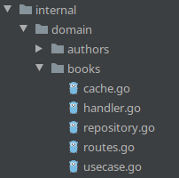
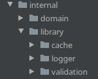

# Introduction
            .,*/(#####(/*,.                               .,*((###(/*.
        .*(%%%%%%%%%%%%%%#/.                           .*#%%%%####%%%%#/.
      ./#%%%%#(/,,...,,***.           .......          *#%%%#*.   ,(%%%#/.
     .(#%%%#/.                    .*(#%%%%%%%##/,.     ,(%%%#*    ,(%%%#*.
    .*#%%%#/.    ..........     .*#%%%%#(/((#%%%%(,     ,/#%%%#(/#%%%#(,
    ./#%%%(*    ,#%%%%%%%%(*   .*#%%%#*     .*#%%%#,      *(%%%%%%%#(,.
    ./#%%%#*    ,(((##%%%%(*   ,/%%%%/.      .(%%%#/   .*#%%%#(*/(#%%%#/,
     ,#%%%#(.        ,#%%%(*   ,/%%%%/.      .(%%%#/  ,/%%%#/.    .*#%%%(,
      *#%%%%(*.      ,#%%%(*   .*#%%%#*     ./#%%%#,  ,(%%%#*      .(%%%#*
       ,(#%%%%%##(((##%%%%(*    .*#%%%%#(((##%%%%(,   .*#%%%##(///(#%%%#/.
         .*/###%%%%%%%###(/,      .,/##%%%%%##(/,.      .*(##%%%%%%##(*,
              .........                ......                .......
A starter kit for Go API development. Inspired by [How I write HTTP services after eight years](https://pace.dev/blog/2018/05/09/how-I-write-http-services-after-eight-years.html).

 However I wanted to use [chi router](https://github.com/go-chi/chi) which is more common in the
  community, [sqlx](github.com/jmoiron/sqlx) for database operations and design towards more like [Clean Architecture](https://blog.cleancoder.com/uncle-bob/2012/08/13/the-clean-architecture.html).

This kit tries to follow the [Standard Go Project Layout](https://github.com/golang-standards/project-layout) to make project structure familiar to a Go developer.

It is still in early stages and I do not consider it is completed until all integration tests are
 completed.

In short, this kit is a Go + Postgres + Chi Router + sqlx starter kit for API development.

# Motivation

On the topic of API development, there are two opposing camps between a framework (like
 [echo](https://github.com/labstack/echo), [gin](https://github.com/gin-gonic/gin),
   [buffalo](http://gobuffalo.io/) and starting small and only add features you need. However
   , starting small and adding features aren't that straightforward. Also, you will want to
    structure your project in such a way that there are clear separation of functionalities for
     different files. This is the idea behind [Clean Architecture](https://blog.cleancoder.com/uncle-bob/2012/08/13/the-clean-architecture.html). This way, it is easy to switch whichever library to another of your choice.

# Features

This kit is composed of standard Go library together with well known libraries to
 manage things like router, database query and migration support.

  - Router/Mux with [Chi Router](https://github.com/go-chi/chi)
  - Database Operations with [sqlx](github.com/jmoiron/sqlx)
  - Database migration with [golang-migrate](https://github.com/golang-migrate/migrate/)
  - Input [validation](https://github.com/go-playground/validator) that return multiple error
   strings
  - Request log that logs each user uniquely based on host address
  - Cors
  - Pagination through middleware

It has few dependencies and replacing one library to another is easy.

# Quickstart

You need to [have a go binary](#appendix) and put into path as well as [git](#appendix). Optionally `docker` and `docker-compose` for easier start up.

Get it

    git clone https://github.com/gmhafiz/go8
    cd go8

The minimum external dependency is the `golang-migrate` program. While technically you can run
 the schema in `database/migration` yourself, it is recommended to use the program instead. But
  before doing this, create a directory where you can put your binaries and add this path to the
   `PATH` environment variable.

    mkdir -p ~/.local/bin

To add this newly created directory to `PATH` environment variable, add this line to `~/.profile
` file

    echo 'PATH=$PATH:$HOME/.local/bin' >> ~/.profile

To make your shell learn of the new path, reload your `~/.profile` file

    source ~/.profile

So we first run a program that downloads all necessary tools for this kit to work. It also
 initializes various settings file including database credentials in `.env` by asking you to set database datasourcename (DSN). This will make the `docker-compose` step
  easy as it can read `.env` file created in this step.

    go run cmd/init/main.go

Have a database ready either by installing them yourself or the following command. the `docker
-compose.yml` will use database credentials set in `.env` file which is initialized by the
 previous step. Optionally, you may redis as well.

    docker-compose up -d postgres

Once the database is up you may run the migration with,

    go run cmd/extmigrate up

Run the API with

    go run cmd/go8/main.go

You will see the address the API is running at as well as all registered routes.

    2020-10-09T11:44:50+11:00 INF internal/server/rest/server.go:26 > starting at 0.0.0.0:3080 service=go8
    2020-10-09T11:44:50+11:00 INF internal/server/rest/server.go:86 >  routes={"method":"GET","path":"/api/v1/authors/"} service=go8
    2020-10-09T11:44:50+11:00 INF internal/server/rest/server.go:86 >  routes={"method":"GET","path":"/api/v1/books/"} service=go8
    2020-10-09T11:44:50+11:00 INF internal/server/rest/server.go:86 >  routes={"method":"POST","path":"/api/v1/books/"} service=go8
    2020-10-09T11:44:50+11:00 INF internal/server/rest/server.go:86 >  routes={"method":"GET","path":"/api/v1/books/{id}"} service=go8
    2020-10-09T11:44:50+11:00 INF internal/server/rest/server.go:86 >  routes={"method":"PUT","path":"/api/v1/books/{id}"} service=go8
    2020-10-09T11:44:50+11:00 INF internal/server/rest/server.go:86 >  routes={"method":"DELETE","path":"/api/v1/books/{id}"} service=go8
    2020-10-09T11:44:50+11:00 INF internal/server/rest/server.go:86 >  routes={"method":"GET","path":"/swagger"} service=go8

To use, follow examples in the `examples/` folder

    curl --location --request GET 'http://localhost:3080/api/v1/books'

# Tools

While the above quickstart is sufficient to start the API, some tools are included for easier task management.

A. This project uses [Task](https://github.com/go-task/task) to handle various tasks such as
 migration, generation of swagger docs, build and run the app. It is essentially a [sh interpreter
 ](https://github.com/mvdan/sh). Only requirement is to download the binary and append to your `PATH` variable.

Install task runner binary bash script:

    sudo ./scripts/install-task.sh

This installs `task` to `/usr/local/bin/task` so `sudo` is needed.

`Task` tasks are defined inside `Taskfile.yml` file. A list of tasks available can be viewed with:

    task -l   # or
    task list

## Migration

Migration is a good step towards having a versioned database and makes publishing to a production
 server a safe process.

### Create Migration

Using `Task`, creating a migration file is done by the following command. Name the file after
 `NAME=`.

    task migrate-create NAME=create_a_tablename

### Migrate up

After you are satisfied with your `.sql` files, run the following command to migrate your database.

    task migrate

Further `golang-migrate` commands are available in its [documentation (postgres)](https://github.com/golang-migrate/migrate/blob/master/database/postgres/TUTORIAL.md)

# Test

Run available unit tests with

    task test # which performs go test -v ./...

# Run

## Local

Conventionally, all apps are placed inside the `cmd` folder.

Using `Task`:

    task run

Without `Task`

    go run cmd/go8/main.go

## Docker

You can build a docker image with the app with its config files. Docker needs to be installed
 beforehand.

     task docker-build

Run the following command to build a container from this image. `--net=host` tells the container
 to use local's network so that it can access local's database.

    task docker-run

# Tooling

Various tooling are included within the `Task` runner

  * `task fmt`
    * Runs `go fmt ./...` to lint Go code
    * `go fmt` is part of official Go toolchain that formats your code into an opinionated format.
  * `task tidy`
    * Runs `go mod tidy` to sync dependencies.
  * `task vet`
    * Quickly catches compile error.
  * `task golint`
    * Runs an opinionated code linter from https://golangci-lint.run/

# Structure

This project mostly follows the structure documented at [Standard Go Project Layout](https://github.com/golang-standards/project-layout).

In addition, this project also tries to follow [Clean Architecture](https://blog.cleancoder.com/uncle-bob/2012/08/13/the-clean-architecture.html) where each functionality are separated into  different files.

## Starting Point
Starting point of project is at `cmd/go8/main.go`

Purpose of this is to initialize all dependencies (logger, read .env, validation, database, redis) and
 passes it on to the `rest` package. After all domains are initialized, the rest server can be
  started.

## Domain
Looking at the `internal/domain/books` folder:

  * `handler.go` handles request coming in to perform input validation, calls usecase, and
    formats the output.
  * `routes.go` defines available routes for `books`.
  * `usecase.go` receives request from handler, perform business logic, and call repository if
   needed.
  * `repository.go` handles database operations. Also may queries redis cache.
  * `cache.go` performs redis queries.

## Configurations

All environment variables are read into specific structs initialized in `configs/configs.go`.

## Database

Migrations are stored in `database/migrations` folder

## Libraries

Initialization of external libraries are located in `internal/library`

# TODO

 - Complete HTTP integration test
 - use [xID](https://github.com/rs/xid) for table ID primary key
 - better control of json output formatting

# Appendix

## Dev Environment Installation

For ubuntu:

    sudo apt update && sudo apt install git
    wget https://golang.org/dl/go1.15.6.linux-amd64.tar.gz
    sudo tar -C /usr/local -xzf go1.15.6.linux-amd64.tar.gz
    export PATH=$PATH:/usr/local/go/bin
    echo 'PATH=$PATH:/usr/local/go/bin' >> ~/.profile

    sudo apt remove docker docker-engine docker.io containerd runc
    sudo apt update
    sudo apt install -y apt-transport-https ca-certificates curl gnupg-agent software-properties-common
    curl -fsSL https://download.docker.com/linux/ubuntu/gpg | sudo apt-key add -
    sudo add-apt-repository "deb [arch=amd64] https://download.docker.com/linux/ubuntu $(lsb_release -cs) stable"
    sudo apt update
    sudo apt install -y docker-ce docker-ce-cli containerd.io
    sudo usermod -aG docker ${USER}
    newgrp docker
    su - ${USER} # or logout and login

    sudo curl -L "https://github.com/docker/compose/releases/download/1.27.4/docker-compose-$(uname -s)-$(uname -m)" -o /usr/local/bin/docker-compose
    sudo chmod +x /usr/local/bin/docker-compose
